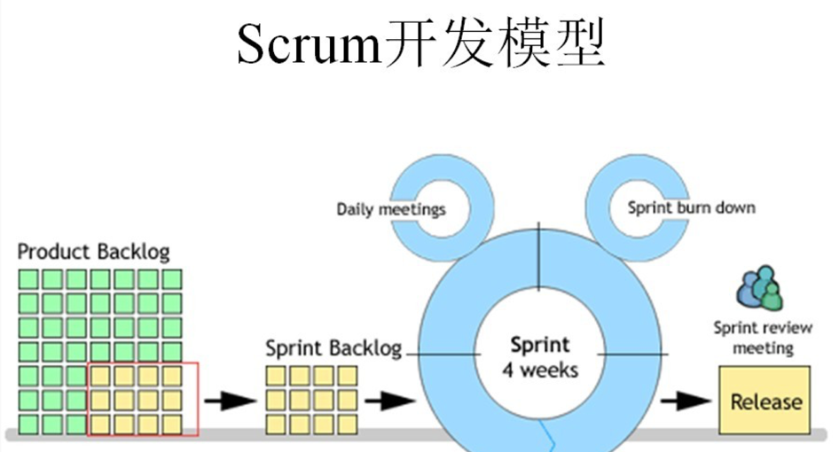
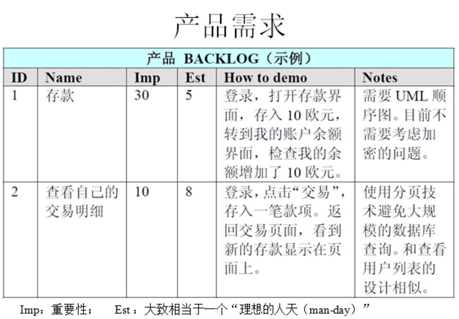
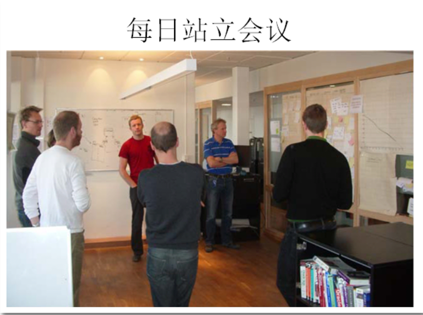
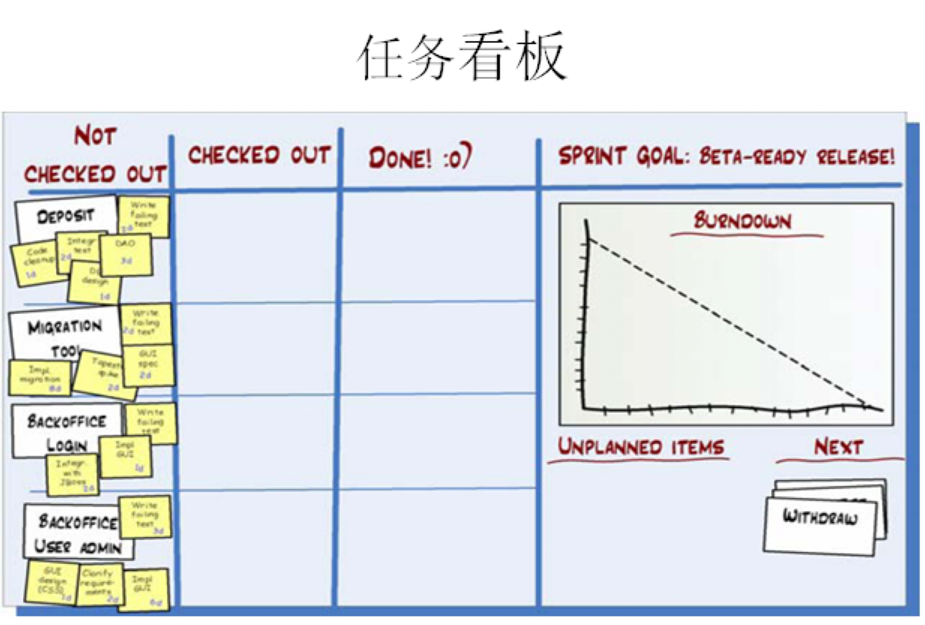
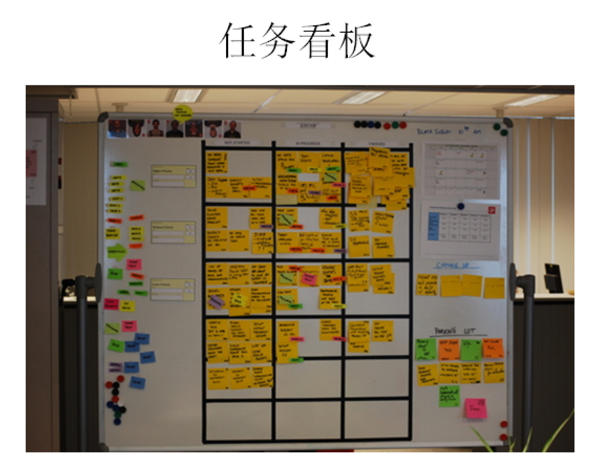
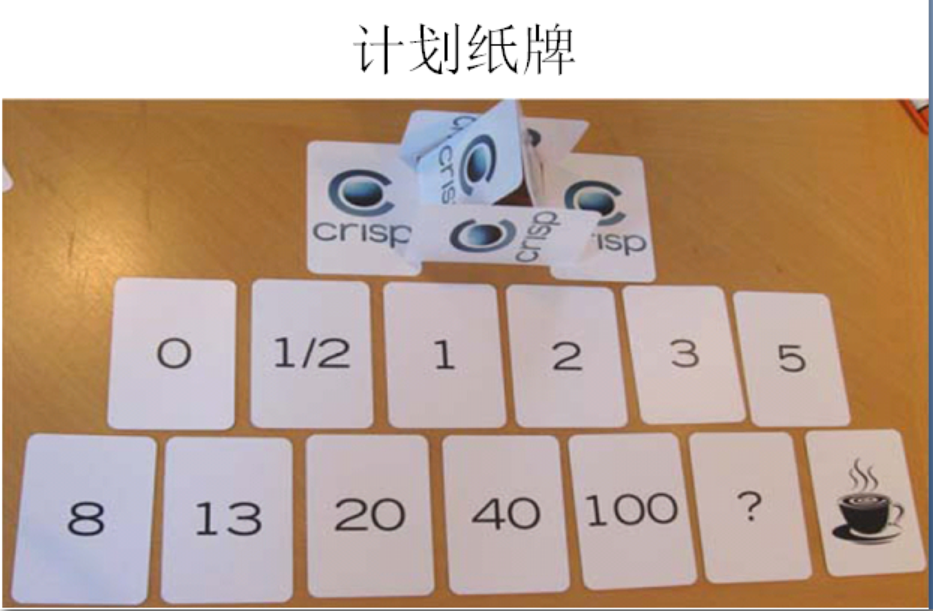

为了工作的需要，于是我也开始学习Scrum，今天主要是对我最近阅读的相关资料，根据自己的理解，用自己的话来讲述Scrum中的各个环节，主要目的有两个，一个是进行知识的总结，另外一个是觉得网上很多学习资料的讲述方式让初学者不太容易理解；所以我决定写一篇扫盲性的博文，同时试着也与园内的朋友一起分享交流一下，希望对初学者有帮助。
 
 什么是敏捷开发？
敏捷开发(Agile Development)是一种以人为核心、迭代、循序渐进的开发方法。
怎么理解呢？首先，我们要理解它不是一门技术，它是一种开发方法，也就是一种软件开发的流程，它会指导我们用规定的环节去一步一步完成项目的开发；而这种开发方式的主要驱动核心是人；它采用的是迭代式开发；
 
为什么说是以人为核心？
我们大部分人都学过瀑布开发模型，它是以文档为驱动的，为什么呢？因为在瀑布的整个开发过程中，要写大量的文档，把需求文档写出来后，开发人员都是根据文档进行开发的，一切以文档为依据；而敏捷开发它只写有必要的文档，或尽量少写文档，敏捷开发注重的是人与人之间，面对面的交流，所以它强调以人为核心。
 
什么是迭代？
迭代是指把一个复杂且开发周期很长的开发任务，分解为很多小周期可完成的任务，这样的一个周期就是一次迭代的过程；同时每一次迭代都可以生产或开发出一个可以交付的软件产品。
 
关于Scrum和XP
前面说了敏捷它是一种指导思想或开发方式，但是它没有明确告诉我们到底采用什么样的流程进行开发，而Scrum和XP就是敏捷开发的具体方式了，你可以采用Scrum方式也可以采用XP方式；Scrum和XP的区别是，Scrum偏重于过程，XP则偏重于实践，但是实际中，两者是结合一起应用的，这里我主要讲Scrum。
 
什么是Scrum？
Scrum的英文意思是橄榄球运动的一个专业术语，表示“争球”的动作；把一个开发流程的名字取名为Scrum，我想你一定能想象出你的开发团队在开发一个项目时，大家像打橄榄球一样迅速、富有战斗激情、人人你争我抢地完成它，你一定会感到非常兴奋的。
而Scrum就是这样的一个开发流程，运用该流程，你就能看到你团队高效的工作。
 
【Scrum开发流程中的三大角色】
产品负责人（Product Owner）
主要负责确定产品的功能和达到要求的标准，指定软件的发布日期和交付的内容，同时有权力接受或拒绝开发团队的工作成果。
 
流程管理员（Scrum Master）
主要负责整个Scrum流程在项目中的顺利实施和进行，以及清除挡在客户和开发工作之间的沟通障碍，使得客户可以直接驱动开发。
 
开发团队（Scrum Team）
主要负责软件产品在Scrum规定流程下进行开发工作，人数控制在5~10人左右，每个成员可能负责不同的技术方面，但要求每成员必须要有很强的自我管理能力，同时具有一定的表达能力；成员可以采用任何工作方式，只要能达到Sprint的目标。
 
 
Scrum流程图

//------------------------
下面，我们开始讲具体实施流程，但是在讲之前，我还要对一个英文单词进行讲解。
什么是Sprint？
Sprint是短距离赛跑的意思，这里面指的是一次迭代，而一次迭代的周期是1个月时间（即4个星期），也就是我们要把一次迭代的开发内容以最快的速度完成它，这个过程我们称它为Sprint。
 
如何进行Scrum开发？
1、我们首先需要确定一个Product Backlog（按优先顺序排列的一个产品需求列表），这个是由Product Owner 负责的；
2、Scrum Team根据Product Backlog列表，做工作量的预估和安排；
3、有了Product Backlog列表，我们需要通过 Sprint Planning Meeting（Sprint计划会议） 来从中挑选出一个Story作为本次迭代完成的目标，这个目标的时间周期是1~4个星期，然后把这个Story进行细化，形成一个Sprint Backlog；
4、Sprint Backlog是由Scrum Team去完成的，每个成员根据Sprint Backlog再细化成更小的任务（细到每个任务的工作量在2天内能完成）；
5、在Scrum Team完成计划会议上选出的Sprint Backlog过程中，需要进行 Daily Scrum Meeting（每日站立会议），每次会议控制在15分钟左右，每个人都必须发言，并且要向所有成员当面汇报你昨天完成了什么，并且向所有成员承诺你今天要完成什么，同时遇到不能解决的问题也可以提出，每个人回答完成后，要走到黑板前更新自己的 Sprint burn down（Sprint燃尽图）；
6、做到每日集成，也就是每天都要有一个可以成功编译、并且可以演示的版本；很多人可能还没有用过自动化的每日集成，其实TFS就有这个功能，它可以支持每次有成员进行签入操作的时候，在服务器上自动获取最新版本，然后在服务器中编译，如果通过则马上再执行单元测试代码，如果也全部通过，则将该版本发布，这时一次正式的签入操作才保存到TFS中，中间有任何失败，都会用邮件通知项目管理人员；
7、当一个Story完成，也就是Sprint Backlog被完成，也就表示一次Sprint完成，这时，我们要进行 Srpint Review Meeting（演示会议），也称为评审会议，产品负责人和客户都要参加（最好本公司老板也参加），每一个Scrum Team的成员都要向他们演示自己完成的软件产品（这个会议非常重要，一定不能取消）；
8、最后就是 Sprint Retrospective Meeting（回顾会议），也称为总结会议，以轮流发言方式进行，每个人都要发言，总结并讨论改进的地方，放入下一轮Sprint的产品需求中；
 
 
下面是运用Scrum开发流程中的一些场景图：

上图是一个 Product Backlog 的示例。
 

上图就是每日的站立会议了，参会人员可以随意姿势站立，任务看板要保证让每个人看到，当每个人发言完后，要走到任务版前更新自己的燃尽图。

任务看版本包含 未完成、正在做、已完成 的工作状态，假设你今天把一个未完成的工作已经完成，那么你要把小卡片从未完成区域贴到已完成区域。

 

每个人的工作进度和完成情况都是公开的，如果有一个人的工作任务在某一个位置放了好几天，大家都能发现他的工作进度出现了什么问题（成员人数最好是5~7个，这样每人可以使用一种专用颜色的标签纸，一眼就可以从任务版看出谁的工作进度快，谁的工作进度慢）
 
 
 上图可不是扑克牌，它是计划纸牌，它的作用是防止项目在开发过程中，被某些人所领导。
怎么用的呢？比如A程序员开发一个功能，需要5个小时，B程序员认为只需要半小时，那他们各自取相应的牌，藏在手中，最后摊牌，如果时间差距很大，那么A和B就可以讨论A为什么要5个小时...
